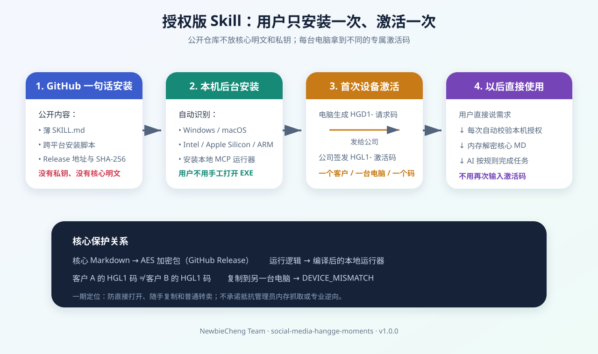

# 授权版 Skill 小白指南

这套方案的目标很简单：用户从 GitHub 一句话安装，公司给每台电脑一个不同的激活码；用户只在第一次粘贴激活码，以后直接在 Codex 或 Cursor 里使用。

## 用户实际只做三步

### 1. 一句话安装

把下面整句话复制给 Codex：

> 请从 https://github.com/NewbieCheng/company-skills-marketplace 安装 `social-media-hangge-moments`。按 catalog.json 下载并校验对应的 GitHub Release，在我的 Windows 或 macOS 上自动安装薄 Skill 和本地运行器；不要让我安装 Git、手工解压或手工打开 EXE。安装完成后返回航哥朋友圈的 HGD1 设备请求码。

Codex 会根据电脑系统选择安装脚本，校验下载包的 SHA-256，然后在用户目录安装运行器并配置 Codex/Cursor。用户不需要看懂二进制，也不用启动一个有界面的 EXE。

### 2. 把设备请求码发给公司

安装后会得到一段以 `HGD1-` 开头的设备请求码。把完整内容发给公司。

公司用内部签发工具生成以 `HGL1-` 开头的激活码。这个激活码同时绑定产品大版本和当前设备，不是所有客户共用的万能密码。

### 3. 粘贴一次激活码

收到公司回复后，在 Codex 或 Cursor 中输入：

> 激活航哥朋友圈，激活码：HGL1-这里粘贴完整激活码

激活成功后，授权保存在本机。以后直接说：

> 使用航哥朋友圈，帮我规划下周每天三条内容。

运行器每次调用都会自动检查授权并在内存里解密，用户不需要再次输入激活码。

## 不同客户怎么区分

| 内容 | 客户 A | 客户 B |
| --- | --- | --- |
| 公开安装包 | 可以相同 | 可以相同 |
| HGD1 设备请求码 | A 电脑生成 | B 电脑生成 |
| HGL1 激活码 | 只匹配 A 设备 | 只匹配 B 设备 |
| 复制激活码到另一台电脑 | 拒绝 | 拒绝 |

所以，GitHub 上的加密包可以复用，真正区分客户的是设备请求码和公司签发的专属激活码。换电脑会产生新的 HGD1 请求码，需要公司按换机政策重新签发。

## 为什么不影响 Token 和速度

- 公开 `SKILL.md` 只保留很短的触发与调用说明，不把全部核心规则常驻在上下文中。
- 本地运行器对体积较小的规则包做 AES 解密；这部分耗时相对模型调用通常非常小。
- 激活码只在第一次输入，不会每次占用对话 Token。
- 真正占 Token 的仍是当前任务需要的规则、客户资料和模型输出。加密不会减少这些必要 Token，但不会额外重复发送激活信息。

## 一期保护到什么程度

一期属于“简单、够用、先卖起来”的离线保护：

- 能防止直接打开 ZIP 看到核心 Markdown。
- 能防止普通客户把激活码复制给另一台电脑。
- 能发现加密包被随手修改。
- 不需要公司维护在线授权服务器。

它不能理论上阻止拥有管理员权限的人做内存抓取、代理记录或长期专业逆向。后续客户端阶段再增加自动更新、登录账号、联网撤销和更强的设备管理。

还要注意：AI 想按核心规则工作，在执行这一刻就必须得到可读规则。一期由本地 MCP 把当前任务需要的解密上下文交给 Codex/Cursor，所以控制整台电脑的人仍可能抓到 MCP 通信或内存。要进一步降低这类暴露，需要在二期让公司客户端自己调用模型，只把最终结果返回宿主 Agent。

一期运行器目前也没有完成 Windows 商业代码签名和 macOS Developer ID 公证。SHA-256 能检查下载内容是否与公司发布的一致，但系统仍可能显示未知发布者警告；正式大规模销售前应补齐签名和真实 Mac 验收。

## 分阶段路线

1. **一期：GitHub + 离线设备码。** 当前实现；公开薄 Skill，Release 放加密包和运行器，公司离线签发 HGL1。
2. **二期：接入公司客户端。** 客户端负责安装、更新、换机申请和授权备份，Codex/Cursor 继续只负责调用。
3. **三期：可选联网授权。** 增加账号席位、远程撤销、统计和灰度更新；对必须物理断网的客户继续保留离线许可证。

## 两种保护模式怎么选

- 只有核心规则是 Markdown：选择“只加密 MD”，代码运行器复用，成本最低，适合一期。
- 代码本身也是核心资产：选择“MD 加密 + 核心代码编译为二进制”，保护更强，发布和多平台测试成本更高。

当前 `social-media-hangge-moments` 使用第二种结构：核心 Markdown 进入加密包，授权和解密逻辑由编译后的本地运行器执行。
